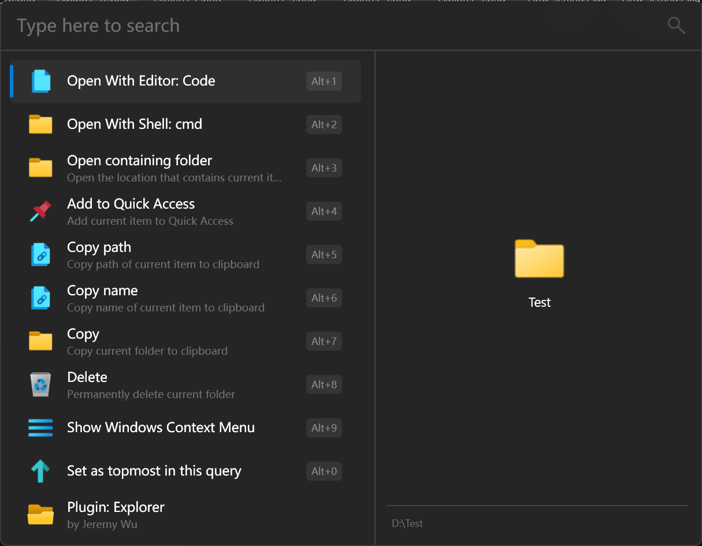

## Explorer Plugin

The Explorer plugin is a default plugin that installs with Flow Launcher. Previously there was an Explorer Plugin and an Everything Plugin but these were merged and you can now choose which search engine will search for what through Flow. Note the Everything is not installed with Flow Launcher so you will need to go to the [VoidTools website](https://www.voidtools.com/) and download and install this separately if you wish to use it. Flow Launcher currently only supports v1.4.x of Everything and not the 1.5 alpha branch. (For 1.5 alpha support please refer to [this](https://github.com/Flow-Launcher/Flow.Launcher/issues/1716) link)

Here is how to configure this plugin:

#### General Setting tab
----

- *Use search result's location as the working directory of the executable* : tick this so Flow will set the working directory of any application you run through the Explorer plugin to the directory of the executable
- *File editor path* and *Folder editor path* : These two options allow you to set a program to open either files or folders, when you right mouse click / SHIFT + ENTER context menu a search result. Note these options will only appear in the context menu if you have set them here.
For example to set up this plugin so you can open any directory in Visual Studio Code, first add the path to your Visual Studio Code install in the Folder editor path setting:

  

  then search for a folder, and then right mouse click / SHIFT + ENTER:

  

  and then choose the *Open With Editor* option
    
  

- *Shell path* : set the executable shell to be launched when the right mouse click / SHIFT + ENTER is chosen. This defaults to the Windows `cmd`
- *Index search engine*, *Content search engine* and *Directory recursive search engine*: These three options let you choose whether Windows Index or Everything (if you have it installed) for specific tasks. The Index is for general filename search, the Content is for searching within text files and the Directory recursive is for listing sub directories within a directory.
- *Open Windows index option*: this opens the Windows Indexing system setting so you can see and adjust exactlky what the Windows Index service is doing.
#### Everything Setting tab
----

- *Search full path* : use the Everything option to search the full path and not just the filename. Equivalent to the `path:` modifier within Everything.
- *Sort Option* : dropdown list to show how the search results are sorted.
- *Everything Path* : If you have Everything installed, Flow Launcher will try and find the installation to use but if you are having issues or it is installed in a non standard dirctory you can specify it explicitly here.
#### Customised Action Keywords tab
----

- For each option here you can choose a custom keyword to trigger that specific type of search. Anything with a `*` is searched for when you type anything in Flow Launcher or if you give the Explorer plugin a global keyword. For example the default to search within documents is set to `doc:` (this is done as searching the contents of documents is slow and so should only trigger when that is definitely what you want to do). If you don't care about exactly what type of search is executed, just use the 'Search' keyword.

#### Quick Access Links tab
----

- Here you can add directories that you work with often, and would like to be returned as soon as you start typing their source location. Directories can also be added and removed from this list with the right mouse click / SHIFT + ENTER context menu from any search result that is a directory.
#### Index Search Excluded Paths tab
----

- Adding a directory here will exclude it from the Flow Launcher search, over riding any settings you maye have in Windows Indexing or Everything.

### Using Everything

If you do choose to use Everything to search, [these Everything commands](https://www.voidtools.com/support/everything/searching/) may be useful to reference.

